# UML / Modelo de datos — Gestión Humana Colbeef

Este documento contiene código Mermaid listo para pegar en:

- https://mermaid.live
- Markdown compatible con Mermaid
- GitHub, GitLab, Obsidian o documentación técnica

> Nota técnica: para una base de datos el diagrama más preciso es un
> **Entidad–Relación (ER)**. Las relaciones rotuladas como `FK física` existen
> realmente en MySQL. Las rotuladas como `relación lógica` son utilizadas por
> la aplicación, aunque la base todavía no declara una restricción `FOREIGN KEY`.

---

## 1. Modelo principal: organización, personal y catálogos

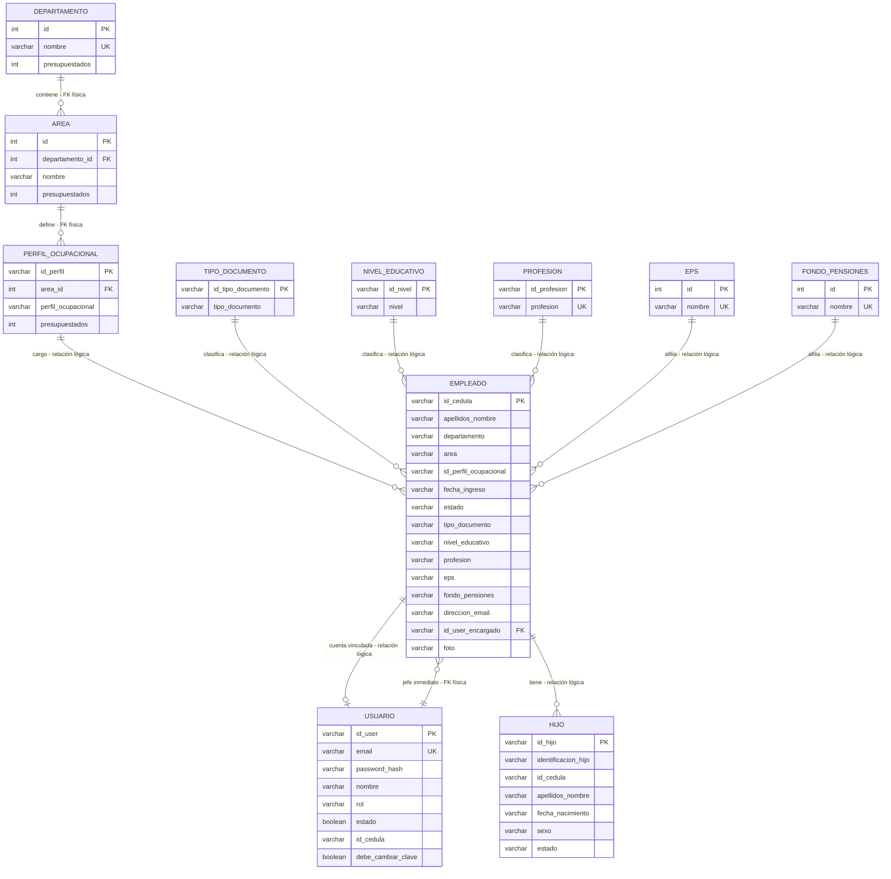

### Jerarquía organizacional

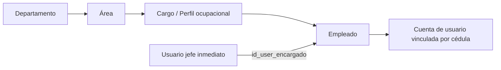

---

## 2. Seguridad, roles, módulos y auditoría

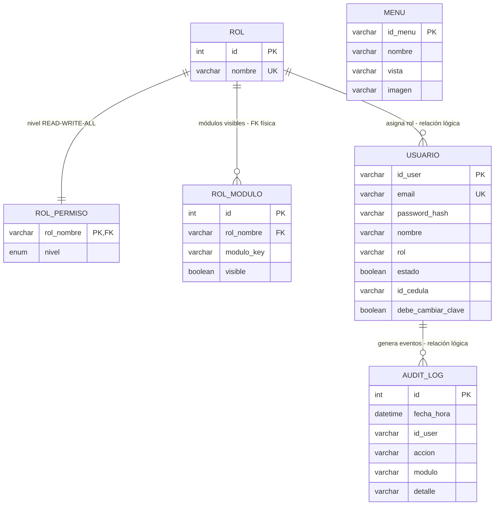

### Flujo de autenticación y autorización

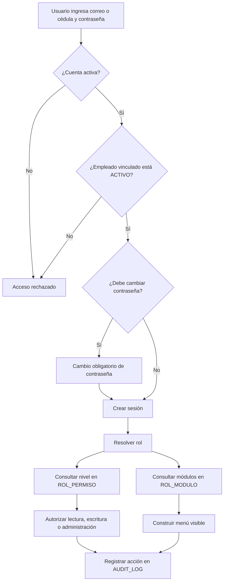

---

## 3. Permisos, vacaciones e incapacidades

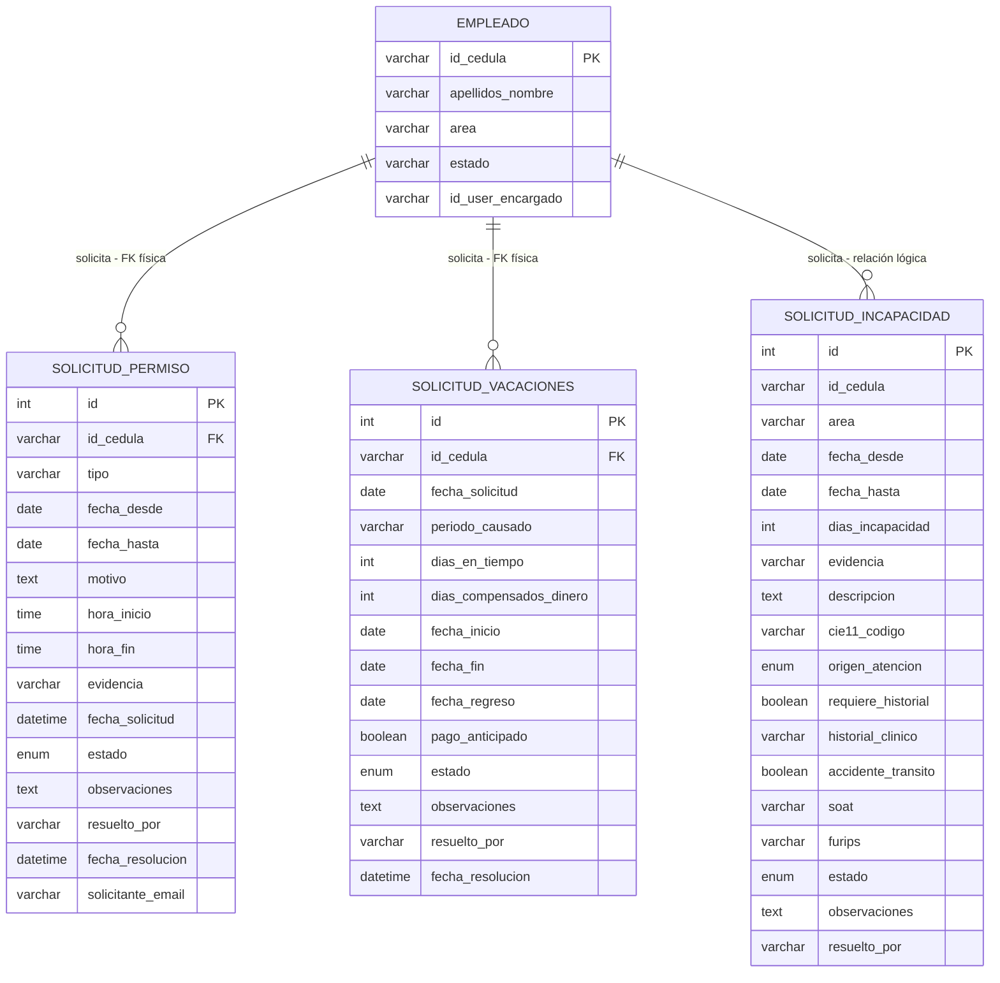

### Flujo general de aprobación

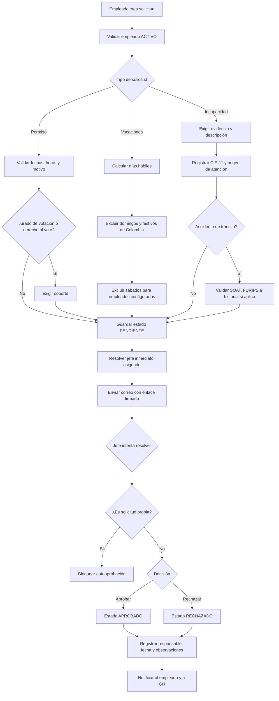

### Estados de una solicitud

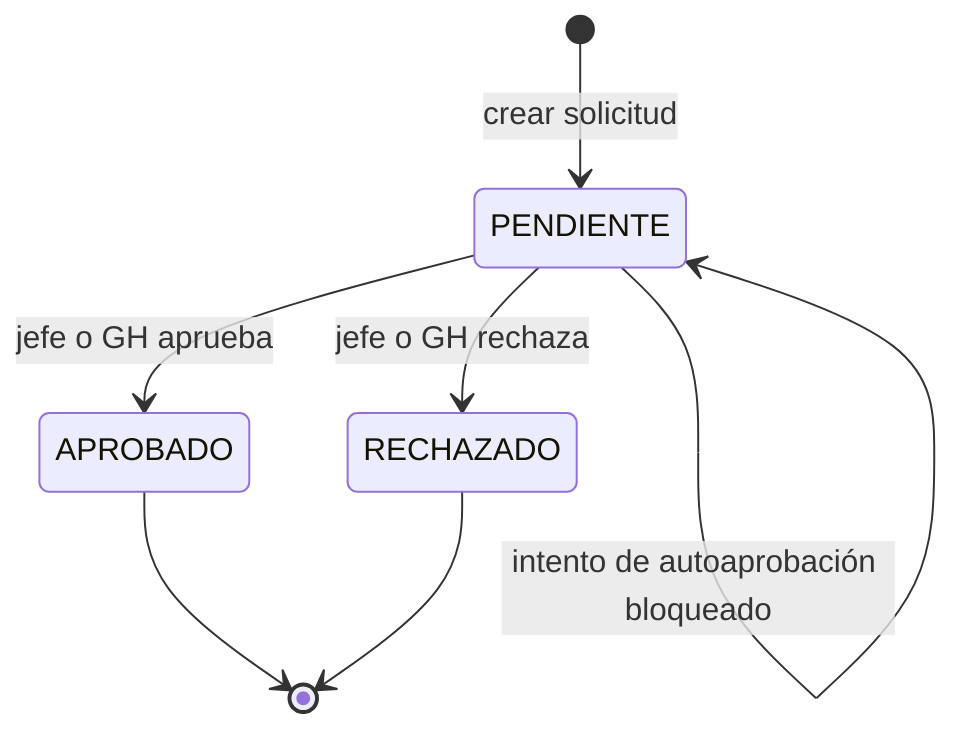

---

## 4. Retiro de personal y Paz y Salvo

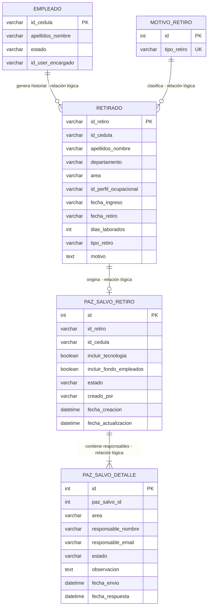

### Flujo de retiro y Paz y Salvo

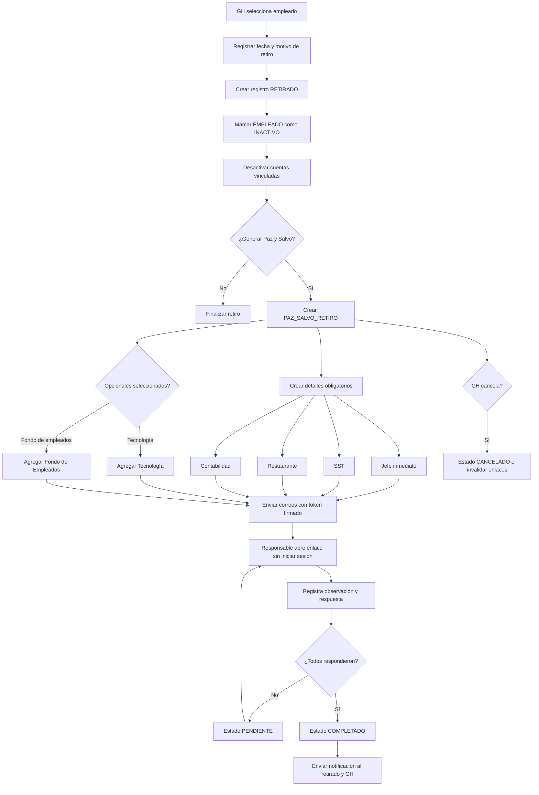

### Estados del Paz y Salvo

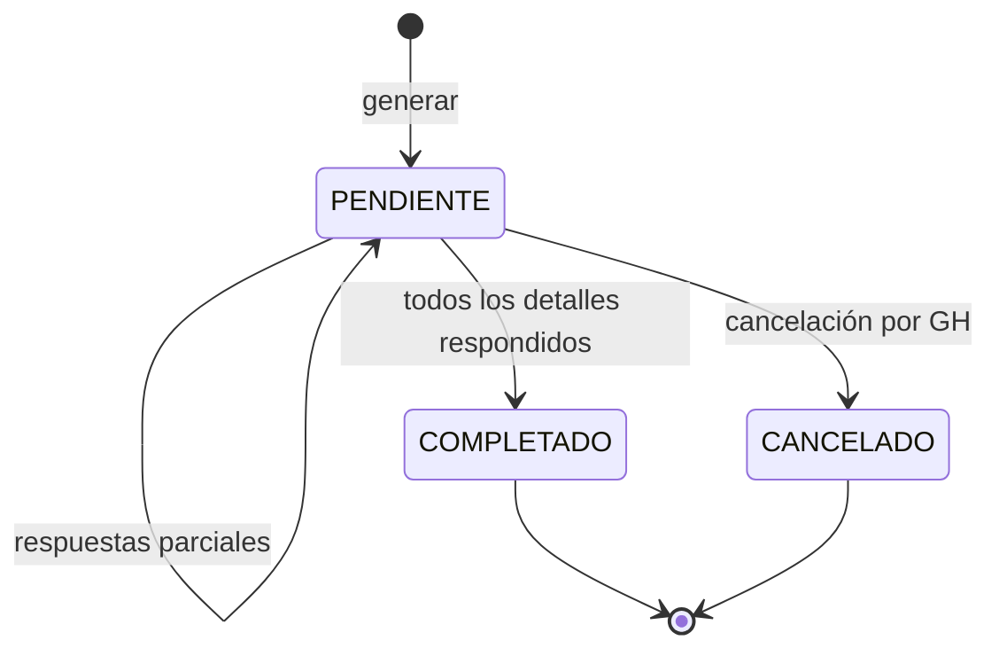

---

## 5. Seguridad y salud en el trabajo

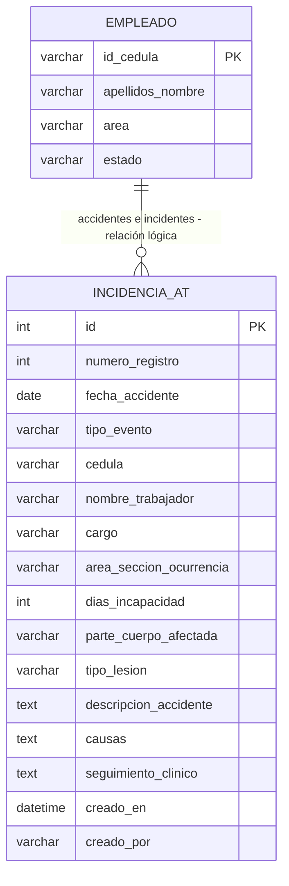

---

## 6. Control de asistencia y liquidación FaceCol

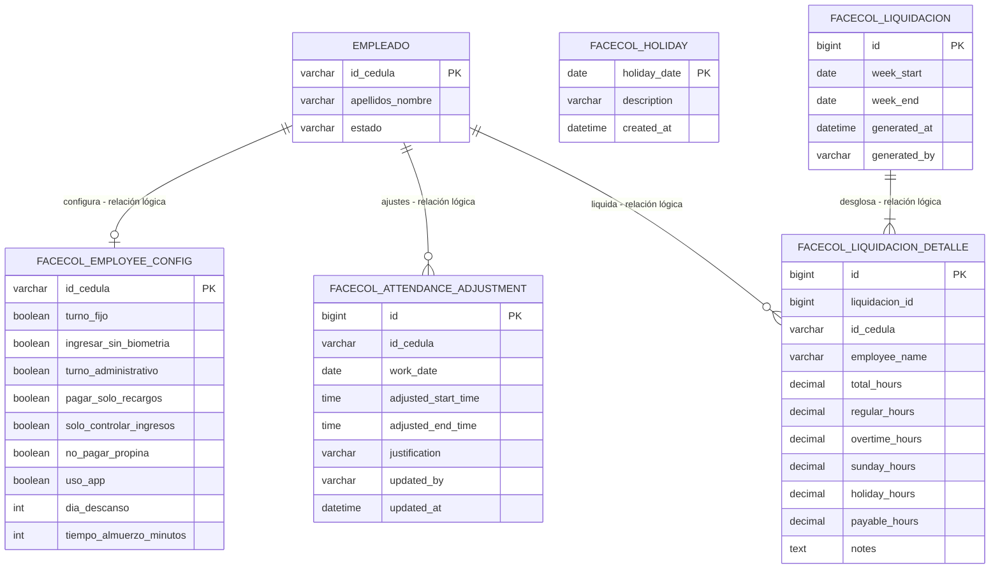

---

## 7. Vista general de módulos

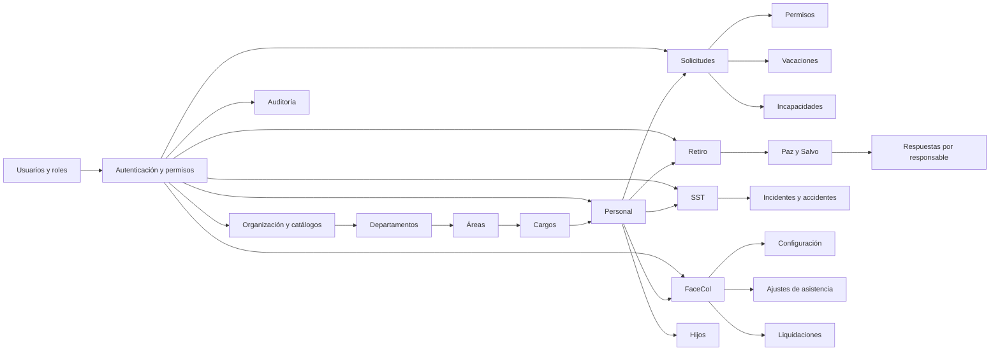

---

## 8. Relaciones físicas existentes actualmente en MySQL

Las claves foráneas que existen físicamente son:

```text
area.departamento_id                 -> departamento.id
perfil_ocupacional.area_id           -> area.id
empleado.id_user_encargado           -> usuario.id_user
rol_modulo.rol_nombre                -> rol.nombre
rol_permiso.rol_nombre               -> rol.nombre
solicitud_permiso.id_cedula          -> empleado.id_cedula
solicitud_vacaciones.id_cedula       -> empleado.id_cedula
```

Relaciones importantes que hoy son lógicas y convendría convertir en claves
foráneas durante una futura normalización:

```text
usuario.id_cedula                    -> empleado.id_cedula
empleado.id_perfil_ocupacional       -> perfil_ocupacional.id_perfil
hijo.id_cedula                       -> empleado.id_cedula
retirado.id_cedula                   -> empleado.id_cedula
retirado.id_perfil_ocupacional       -> perfil_ocupacional.id_perfil
solicitud_incapacidad.id_cedula      -> empleado.id_cedula
paz_salvo_retiro.id_retiro           -> retirado.id_retiro
paz_salvo_detalle.paz_salvo_id       -> paz_salvo_retiro.id
audit_log.id_user                    -> usuario.id_user
facecol_employee_config.id_cedula    -> empleado.id_cedula
facecol_attendance_adjustment.id_cedula -> empleado.id_cedula
facecol_liquidacion_detalle.liquidacion_id -> facecol_liquidacion.id
facecol_liquidacion_detalle.id_cedula -> empleado.id_cedula
```

